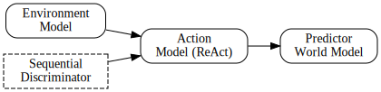

# GRAIL Simulation

Grounded-Retrieval Adversarial Imitation Loop (GRAIL) is a framework for grounded human behavior simulation that unifies language, agent, and world models. The system retrieves realistic action slates, reasons about them with a ReAct-style language agent, predicts counterfactual outcomes, and aligns to real trajectories through adversarial training.



## Key Components

- **Environment Model** – retrieves candidate next actions from behavior logs to keep the agent grounded.
- **Action Model (ReAct)** – a language model selects among retrieved actions while reasoning about the current state.
- **Predictor / World Model** – estimates outcomes and counterfactuals for chosen actions.
- **Sequential Discriminator** – supplies adversarial rewards that align generated trajectories with real data.

## Repository Structure

- `src/open_r1/` – training utilities for supervised fine-tuning and GRPO-style reinforcement learning, including a simplified GRPO trainer specialised for GRAIL.
- `src/gpt-4o/` – baseline script to evaluate GPT‑4o on next‑video choice using the same prompts as the GRPO setup.
- `src/knn/` – non‑generative k‑nearest neighbours baseline for slate‑constrained prediction.
- `recipes/` – configuration files for different model sizes and training modes.
- `training-grail.sh` – convenience script to launch GRPO training with preset configs.

## Quick Start

1. Install Python dependencies and system packages (e.g. `graphviz` for diagram generation).
2. Choose a model recipe from `recipes/` and launch training:
   ```bash
   bash training-grail.sh recipes/Qwen2.5-1.5B-Instruct/grpo/config_grail.yaml
   ```
3. Evaluate baselines:
   - GPT‑4o: `python src/gpt-4o/gpt-4o-baseline.py`
   - KNN: `python src/knn/knn-baseline.py`

## Citation
If you use this work, please cite:
> Liv d'Aliberti and Manoel Horta Ribeiro. "Grounded-Retrieval Adversarial Imitation Loop: Integrating Language, Agent, and World Models," 2025.

## License
This repository contains code released under the Apache 2.0 license. See individual files for details.
