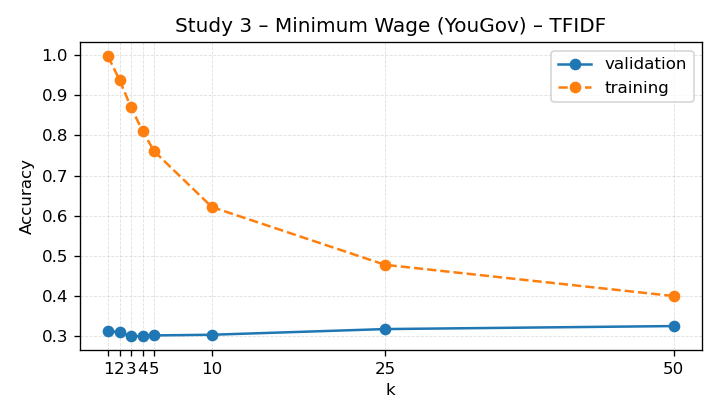
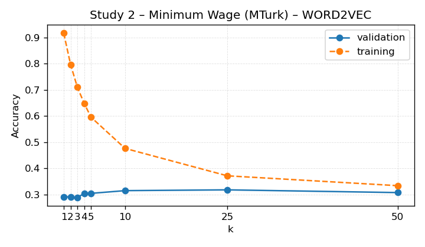
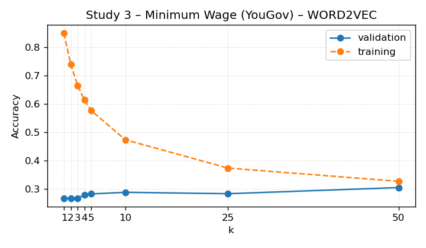

# KNN Next-Video Baseline

This report summarises the slate-ranking KNN model that predicts the next clicked video.

- Dataset: `/n/fs/similarity/grail-simulation/data/cleaned_grail`
- Split: validation
- Metric: eligible-only accuracy (gold index present).
- Note: an all-rows accuracy (including ineligible slates) is also recorded in the per-study metrics as `accuracy_overall_all_rows` to ease comparison with XGB's overall accuracy.
- Baseline column: accuracy from recommending the most frequent gold index.
- Δ column: improvement over that baseline accuracy.
- Random column: expected accuracy from uniformly sampling one candidate per slate.
- Uncertainty: participant_bootstrap (n_bootstrap=500, n_groups=162, n_rows=548, seed=2024)

## Portfolio Summary

| Feature space | Weighted accuracy ↑ | Δ vs baseline ↑ | Random ↑ | Eligible | Studies |
| --- | ---: | ---: | ---: | ---: | ---: |
| TFIDF | 0.425 | -0.038 | 0.271 | 2,419 | 3 |
| WORD2VEC | 0.279 | -0.183 | 0.271 | 2,419 | 3 |

Best-performing feature space: **TFIDF** with weighted accuracy 0.425 across 2,419 eligible slates (3 studies).

## TF-IDF Feature Space

| Study | Accuracy ↑ | Accuracy (all rows) ↑ | 95% CI | Δ vs baseline ↑ | Baseline ↑ | Random ↑ | Best k | Eligible | Total |
| --- | ---: | ---: | --- | ---: | ---: | ---: | ---: | ---: | ---: |
| Study 1 – Gun Control (MTurk) | 0.763 | 0.763 | [0.727, 0.799] | +0.223 | 0.540 | 0.326 | 2 | 548 | 548 |
| Study 2 – Minimum Wage (MTurk) | 0.355 | 0.355 | [0.318, 0.390] | -0.013 | 0.368 | 0.255 | 2 | 671 | 671 |
| Study 3 – Minimum Wage (YouGov) | 0.309 | 0.309 | [0.287, 0.336] | -0.170 | 0.479 | 0.255 | 2 | 1,200 | 1,200 |

## Word2Vec Feature Space

| Study | Accuracy ↑ | Accuracy (all rows) ↑ | 95% CI | Δ vs baseline ↑ | Baseline ↑ | Random ↑ | Best k | Eligible | Total |
| --- | ---: | ---: | --- | ---: | ---: | ---: | ---: | ---: | ---: |
| Study 1 – Gun Control (MTurk) | 0.288 | 0.288 | [0.256, 0.322] | -0.252 | 0.540 | 0.326 | 2 | 548 | 548 |
| Study 2 – Minimum Wage (MTurk) | 0.292 | 0.292 | [0.258, 0.328] | -0.076 | 0.368 | 0.255 | 2 | 671 | 671 |
| Study 3 – Minimum Wage (YouGov) | 0.268 | 0.268 | [0.245, 0.291] | -0.212 | 0.479 | 0.255 | 2 | 1,200 | 1,200 |

## Accuracy Curves

### Study 1 – Gun Control (MTurk) (TFIDF)

### Study 2 – Minimum Wage (MTurk) (TFIDF)

### Study 3 – Minimum Wage (YouGov) (TFIDF)

### Study 1 – Gun Control (MTurk) (WORD2VEC)

### Study 2 – Minimum Wage (MTurk) (WORD2VEC)

### Study 3 – Minimum Wage (YouGov) (WORD2VEC)

## Observations

- TFIDF: Study 1 – Gun Control (MTurk): 0.763 (baseline 0.540, Δ +0.223, k=2, eligible 548); Study 2 – Minimum Wage (MTurk): 0.355 (baseline 0.368, Δ -0.013, k=2, eligible 671); Study 3 – Minimum Wage (YouGov): 0.309 (baseline 0.479, Δ -0.170, k=2, eligible 1,200); averages: mean Δ +0.013, mean random 0.279.
- WORD2VEC: Study 1 – Gun Control (MTurk): 0.288 (baseline 0.540, Δ -0.252, k=2, eligible 548); Study 2 – Minimum Wage (MTurk): 0.292 (baseline 0.368, Δ -0.076, k=2, eligible 671); Study 3 – Minimum Wage (YouGov): 0.268 (baseline 0.479, Δ -0.212, k=2, eligible 1,200); averages: mean Δ -0.180, mean random 0.279.
- Random values approximate the accuracy from uniformly guessing across the slate.

## KNN vs XGB (Matched Studies)

This section compares the eligible-only accuracy for KNN and XGB, and also shows an all-rows accuracy for KNN alongside XGB's overall accuracy.

| Study | KNN (feature) eligible-only ↑ | XGB eligible-only ↑ | KNN all-rows ↑ | XGB overall ↑ |
| --- | ---: | ---: | ---: | ---: |
| Study 1 – Gun Control (MTurk) | 0.763 (TFIDF) | 0.874 | 0.763 | 0.874 |
| Study 2 – Minimum Wage (MTurk) | 0.355 (TFIDF) | 0.329 | 0.355 | 0.329 |
| Study 3 – Minimum Wage (YouGov) | 0.309 (TFIDF) | 0.359 | 0.309 | 0.359 |

## Cross-Study Holdouts

## TF-IDF Feature Space

Key holdout takeaways:

- Highest holdout accuracy: Study 1 – Gun Control (MTurk) (0.763) +0.223 vs. baseline.
- Lowest holdout accuracy: Study 2 – Minimum Wage (MTurk) (0.355) -0.013 vs. baseline.
- Average accuracy delta across holdouts: +0.105.

| Holdout study | Accuracy ↑ | Δ vs baseline ↑ | Baseline ↑ | Best k | Eligible |
| --- | ---: | ---: | ---: | ---: | ---: |
| Study 1 – Gun Control (MTurk) | 0.763 | +0.223 | 0.540 | 2 | 548 |
| Study 2 – Minimum Wage (MTurk) | 0.355 | -0.013 | 0.368 | 2 | 671 |

