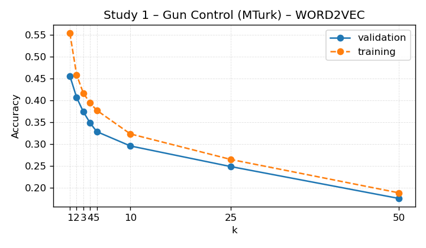

# KNN Next-Video Baseline

This report summarises the slate-ranking KNN model that predicts the next clicked video.

- Dataset: `/n/fs/similarity/grail-simulation/data/cleaned_grail`
- Split: validation
- Metric: accuracy on eligible slates (gold index present).
- Baseline column: accuracy from recommending the most frequent gold index.
- Δ column: improvement over that baseline accuracy.
- Random column: expected accuracy from uniformly sampling one candidate per slate.
- Uncertainty: participant_bootstrap (n_bootstrap=500, n_groups=162, n_rows=548, seed=2024)

## Portfolio Summary

| Feature space | Weighted accuracy ↑ | Δ vs baseline ↑ | Random ↑ | Eligible | Studies |
| --- | ---: | ---: | ---: | ---: | ---: |
| TFIDF | 0.454 | +0.008 | 0.287 | 1,219 | 2 |
| WORD2VEC | 0.290 | -0.155 | 0.287 | 1,219 | 2 |

Best-performing feature space: **TFIDF** with weighted accuracy 0.454 across 1,219 eligible slates (2 studies).

## TF-IDF Feature Space

| Study | Accuracy ↑ | 95% CI | Δ vs baseline ↑ | Baseline ↑ | Random ↑ | Best k | Eligible | Total |
| --- | ---: | --- | ---: | ---: | ---: | ---: | ---: | ---: |
| Study 1 – Gun Control (MTurk) | 0.577 | [0.530, 0.618] | +0.036 | 0.540 | 0.326 | 10 | 548 | 548 |
| Study 2 – Minimum Wage (MTurk) | 0.353 | [0.315, 0.393] | -0.015 | 0.368 | 0.255 | 25 | 671 | 671 |

## Word2Vec Feature Space

| Study | Accuracy ↑ | 95% CI | Δ vs baseline ↑ | Baseline ↑ | Random ↑ | Best k | Eligible | Total |
| --- | ---: | --- | ---: | ---: | ---: | ---: | ---: | ---: |
| Study 1 – Gun Control (MTurk) | 0.246 | [0.213, 0.281] | -0.294 | 0.540 | 0.326 | 10 | 548 | 548 |
| Study 2 – Minimum Wage (MTurk) | 0.326 | [0.290, 0.364] | -0.042 | 0.368 | 0.255 | 10 | 671 | 671 |

## Accuracy Curves

### Study 1 – Gun Control (MTurk) (TFIDF)

### Study 2 – Minimum Wage (MTurk) (TFIDF)

### Study 1 – Gun Control (MTurk) (WORD2VEC)

### Study 2 – Minimum Wage (MTurk) (WORD2VEC)

## Observations

- TFIDF: Study 1 – Gun Control (MTurk): 0.577 (baseline 0.540, Δ +0.036, k=10, eligible 548); Study 2 – Minimum Wage (MTurk): 0.353 (baseline 0.368, Δ -0.015, k=25, eligible 671); averages: mean Δ +0.011, mean random 0.291.
- WORD2VEC: Study 1 – Gun Control (MTurk): 0.246 (baseline 0.540, Δ -0.294, k=10, eligible 548); Study 2 – Minimum Wage (MTurk): 0.326 (baseline 0.368, Δ -0.042, k=10, eligible 671); averages: mean Δ -0.168, mean random 0.291.
- Random values approximate the accuracy from uniformly guessing across the slate.

Leave-one-study-out metrics were unavailable when this report was generated.

