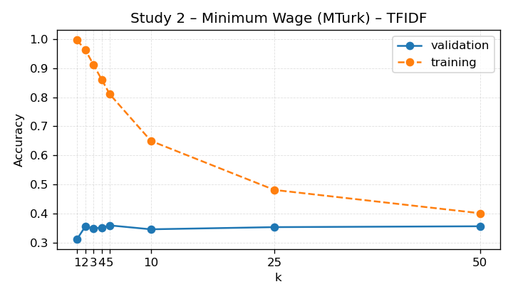

# KNN Next-Video Baseline

This report summarises the slate-ranking KNN model that predicts the next clicked video.

- Dataset: `/n/fs/similarity/grail-simulation/data/cleaned_grail`
- Split: validation
- Metric: accuracy on eligible slates (gold index present).
- Baseline column: accuracy from recommending the most frequent gold index.
- Δ column: improvement over that baseline accuracy.
- Random column: expected accuracy from uniformly sampling one candidate per slate.
- Uncertainty: participant_bootstrap (n_bootstrap=500, n_groups=162, n_rows=548, seed=2024)

## Portfolio Summary

| Feature space | Weighted accuracy ↑ | Δ vs baseline ↑ | Random ↑ | Eligible | Studies |
| --- | ---: | ---: | ---: | ---: | ---: |
| TFIDF | 0.408 | -0.054 | 0.271 | 2,419 | 3 |

Best-performing feature space: **TFIDF** with weighted accuracy 0.408 across 2,419 eligible slates (3 studies).

## TF-IDF Feature Space

| Study | Accuracy ↑ | 95% CI | Δ vs baseline ↑ | Baseline ↑ | Random ↑ | Best k | Eligible | Total |
| --- | ---: | --- | ---: | ---: | ---: | ---: | ---: | ---: |
| Study 1 – Gun Control (MTurk) | 0.717 | [0.674, 0.757] | +0.177 | 0.540 | 0.326 | 3 | 548 | 548 |
| Study 2 – Minimum Wage (MTurk) | 0.352 | [0.316, 0.385] | -0.016 | 0.368 | 0.255 | 3 | 671 | 671 |
| Study 3 – Minimum Wage (YouGov) | 0.299 | [0.274, 0.327] | -0.180 | 0.479 | 0.255 | 3 | 1,200 | 1,200 |

## Accuracy Curves

### Study 1 – Gun Control (MTurk) (TFIDF)

### Study 2 – Minimum Wage (MTurk) (TFIDF)

### Study 3 – Minimum Wage (YouGov) (TFIDF)

## Observations

- TFIDF: Study 1 – Gun Control (MTurk): 0.717 (baseline 0.540, Δ +0.177, k=3, eligible 548); Study 2 – Minimum Wage (MTurk): 0.352 (baseline 0.368, Δ -0.016, k=3, eligible 671); Study 3 – Minimum Wage (YouGov): 0.299 (baseline 0.479, Δ -0.180, k=3, eligible 1,200); averages: mean Δ -0.006, mean random 0.279.
- Random values approximate the accuracy from uniformly guessing across the slate.

## Cross-Study Holdouts

## TF-IDF Feature Space

Key holdout takeaways:

- Highest holdout accuracy: Study 1 – Gun Control (MTurk) (0.141) -0.400 vs. baseline.
- Lowest holdout accuracy: Study 1 – Gun Control (MTurk) (0.141) -0.400 vs. baseline.
- Average accuracy delta across holdouts: -0.400.

| Holdout study | Accuracy ↑ | Δ vs baseline ↑ | Baseline ↑ | Best k | Eligible |
| --- | ---: | ---: | ---: | ---: | ---: |
| Study 1 – Gun Control (MTurk) | 0.141 | -0.400 | 0.540 | 3 | 548 |

