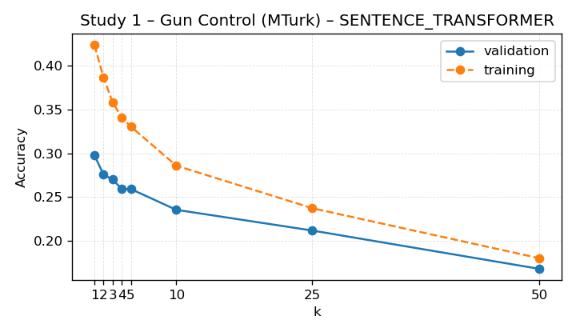
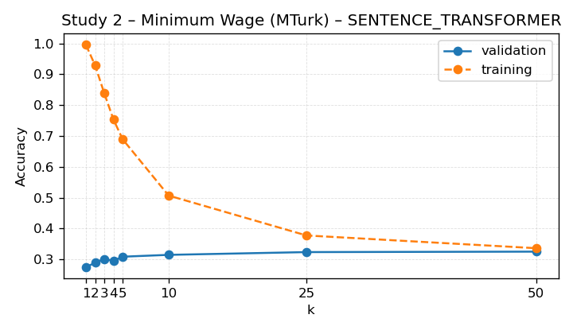
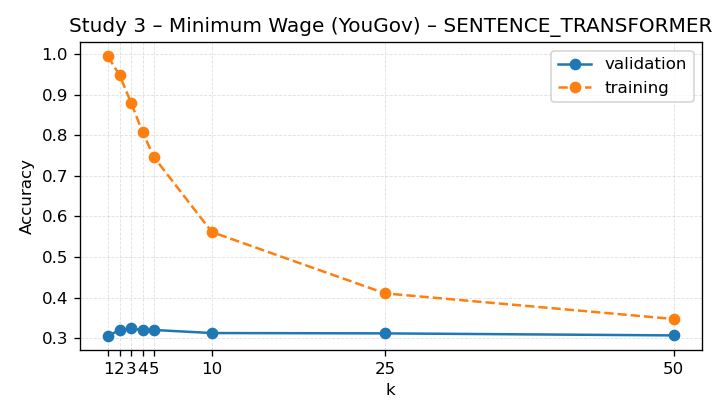

# KNN Next-Video Baseline

This report summarises the slate-ranking KNN model that predicts the next video a viewer will click.

- Dataset: `/n/fs/similarity/grail-simulation/data/cleaned_grail`
- Split: validation
- Metric: accuracy on eligible slates (gold index present)
- Baseline column: accuracy from always recommending the most-frequent gold index for the study.
- Δ column: improvement over that baseline accuracy.
- Random column: expected accuracy from uniformly sampling one candidate per slate.
- Uncertainty: participant_bootstrap (n_bootstrap=500, n_groups=162, n_rows=548, seed=2024)

## Portfolio Summary

| Feature space | Weighted accuracy ↑ | Δ vs baseline ↑ | Random ↑ | Eligible | Studies |
| --- | ---: | ---: | ---: | ---: | ---: |
| TFIDF | 0.440 | -0.022 | 0.271 | 2,419 | 3 |
| WORD2VEC | 0.412 | -0.050 | 0.271 | 2,419 | 3 |
| SENTENCE_TRANSFORMER | 0.427 | -0.036 | 0.271 | 2,419 | 3 |

Best-performing feature space: **TFIDF** with weighted accuracy 0.440 across 2,419 eligible slates (3 studies).

## TF-IDF Feature Space

| Study | Accuracy ↑ | 95% CI | Δ vs baseline ↑ | Baseline ↑ | Random ↑ | Best k | Eligible | Total |
| --- | ---: | --- | ---: | ---: | ---: | ---: | ---: | ---: |
| Study 1 – Gun Control (MTurk) | 0.889 | [0.859, 0.922] | +0.349 | 0.540 | 0.326 | 2 | 548 | 548 |
| Study 2 – Minimum Wage (MTurk) | 0.338 | [0.300, 0.372] | -0.030 | 0.368 | 0.255 | 3 | 671 | 671 |
| Study 3 – Minimum Wage (YouGov) | 0.292 | [0.270, 0.317] | -0.187 | 0.479 | 0.255 | 2 | 1,200 | 1,200 |

## Word2Vec Feature Space

| Study | Accuracy ↑ | 95% CI | Δ vs baseline ↑ | Baseline ↑ | Random ↑ | Best k | Eligible | Total |
| --- | ---: | --- | ---: | ---: | ---: | ---: | ---: | ---: |
| Study 1 – Gun Control (MTurk) | 0.859 | [0.824, 0.896] | +0.319 | 0.540 | 0.326 | 2 | 548 | 548 |
| Study 2 – Minimum Wage (MTurk) | 0.268 | [0.232, 0.305] | -0.100 | 0.368 | 0.255 | 2 | 671 | 671 |
| Study 3 – Minimum Wage (YouGov) | 0.288 | [0.263, 0.313] | -0.191 | 0.479 | 0.255 | 10 | 1,200 | 1,200 |

## Sentence-Transformer Feature Space

| Study | Accuracy ↑ | 95% CI | Δ vs baseline ↑ | Baseline ↑ | Random ↑ | Best k | Eligible | Total |
| --- | ---: | --- | ---: | ---: | ---: | ---: | ---: | ---: |
| Study 1 – Gun Control (MTurk) | 0.801 | [0.765, 0.838] | +0.261 | 0.540 | 0.326 | 2 | 548 | 548 |
| Study 2 – Minimum Wage (MTurk) | 0.308 | [0.276, 0.350] | -0.060 | 0.368 | 0.255 | 3 | 671 | 671 |
| Study 3 – Minimum Wage (YouGov) | 0.322 | [0.294, 0.346] | -0.158 | 0.479 | 0.255 | 2 | 1,200 | 1,200 |

### Study 1 – Gun Control (MTurk) (TFIDF)

### Study 2 – Minimum Wage (MTurk) (TFIDF)

### Study 3 – Minimum Wage (YouGov) (TFIDF)

### Study 1 – Gun Control (MTurk) (WORD2VEC)

### Study 2 – Minimum Wage (MTurk) (WORD2VEC)

### Study 3 – Minimum Wage (YouGov) (WORD2VEC)

### Study 1 – Gun Control (MTurk) (SENTENCE_TRANSFORMER)

### Study 2 – Minimum Wage (MTurk) (SENTENCE_TRANSFORMER)

### Study 3 – Minimum Wage (YouGov) (SENTENCE_TRANSFORMER)

## Observations

- TFIDF: Study 1 – Gun Control (MTurk): 0.889 (baseline 0.540, Δ +0.349, k=2, eligible 548); Study 2 – Minimum Wage (MTurk): 0.338 (baseline 0.368, Δ -0.030, k=3, eligible 671); Study 3 – Minimum Wage (YouGov): 0.292 (baseline 0.479, Δ -0.187, k=2, eligible 1,200); averages: mean Δ +0.044, mean random 0.279.
- WORD2VEC: Study 1 – Gun Control (MTurk): 0.859 (baseline 0.540, Δ +0.319, k=2, eligible 548); Study 2 – Minimum Wage (MTurk): 0.268 (baseline 0.368, Δ -0.100, k=2, eligible 671); Study 3 – Minimum Wage (YouGov): 0.288 (baseline 0.479, Δ -0.191, k=10, eligible 1,200); averages: mean Δ +0.010, mean random 0.279.
- SENTENCE_TRANSFORMER: Study 1 – Gun Control (MTurk): 0.801 (baseline 0.540, Δ +0.261, k=2, eligible 548); Study 2 – Minimum Wage (MTurk): 0.308 (baseline 0.368, Δ -0.060, k=3, eligible 671); Study 3 – Minimum Wage (YouGov): 0.322 (baseline 0.479, Δ -0.158, k=2, eligible 1,200); averages: mean Δ +0.015, mean random 0.279.
- Random values correspond to the expected accuracy from a uniform guess across the slate options.

## Cross-Study Holdouts

## TF-IDF Feature Space

| Holdout study | Accuracy ↑ | Δ vs baseline ↑ | Baseline ↑ | Best k | Eligible |
| --- | ---: | ---: | ---: | ---: | ---: |
| Study 1 – Gun Control (MTurk) | 0.257 | -0.283 | 0.540 | 2 | 548 |
| Study 2 – Minimum Wage (MTurk) | 0.283 | -0.085 | 0.368 | 2 | 671 |
| Study 3 – Minimum Wage (YouGov) | 0.282 | -0.198 | 0.479 | 4 | 1,200 |

## Word2Vec Feature Space

| Holdout study | Accuracy ↑ | Δ vs baseline ↑ | Baseline ↑ | Best k | Eligible |
| --- | ---: | ---: | ---: | ---: | ---: |
| Study 1 – Gun Control (MTurk) | 0.336 | -0.204 | 0.540 | 2 | 548 |
| Study 2 – Minimum Wage (MTurk) | 0.265 | -0.103 | 0.368 | 2 | 671 |
| Study 3 – Minimum Wage (YouGov) | 0.265 | -0.214 | 0.479 | 2 | 1,200 |

## Sentence-Transformer Feature Space

| Holdout study | Accuracy ↑ | Δ vs baseline ↑ | Baseline ↑ | Best k | Eligible |
| --- | ---: | ---: | ---: | ---: | ---: |
| Study 1 – Gun Control (MTurk) | 0.027 | -0.513 | 0.540 | 2 | 548 |
| Study 2 – Minimum Wage (MTurk) | 0.313 | -0.055 | 0.368 | 3 | 671 |
