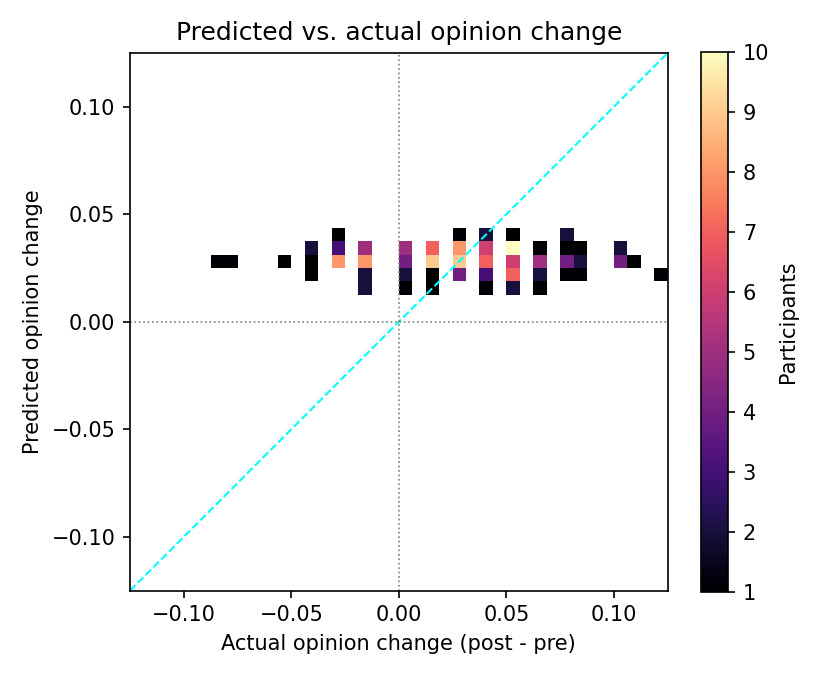
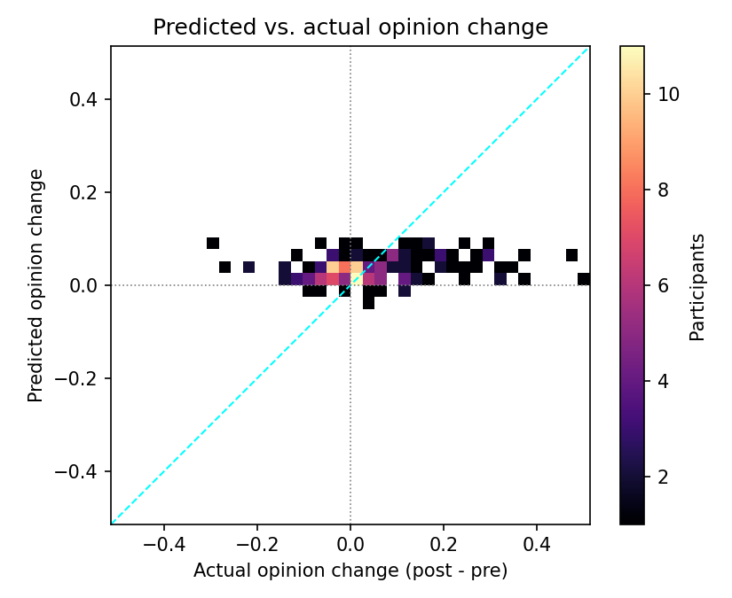
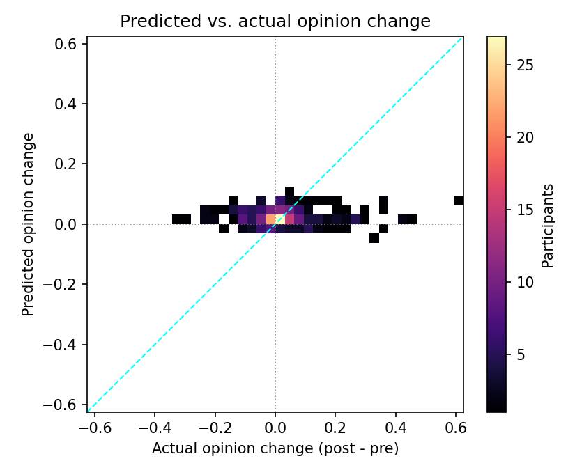
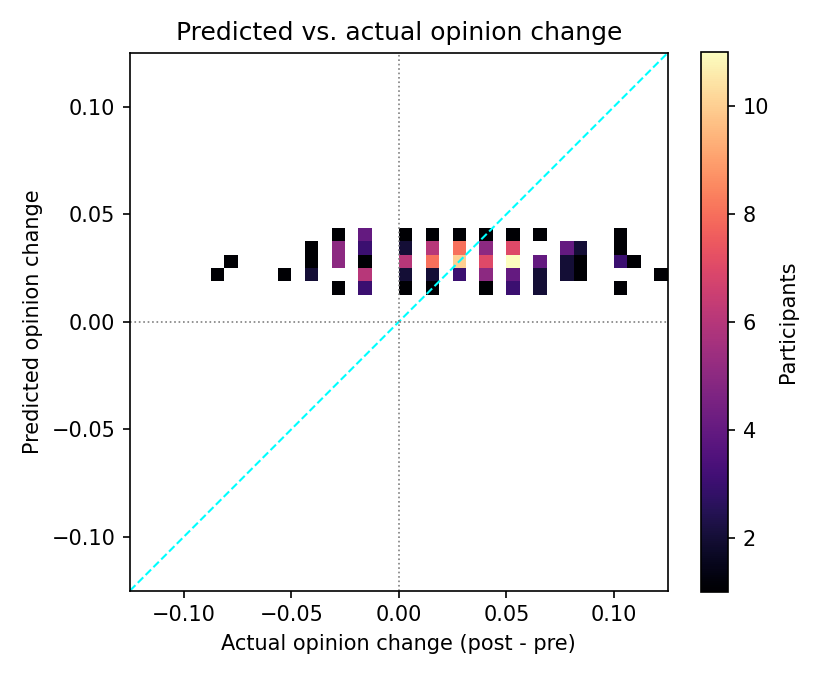
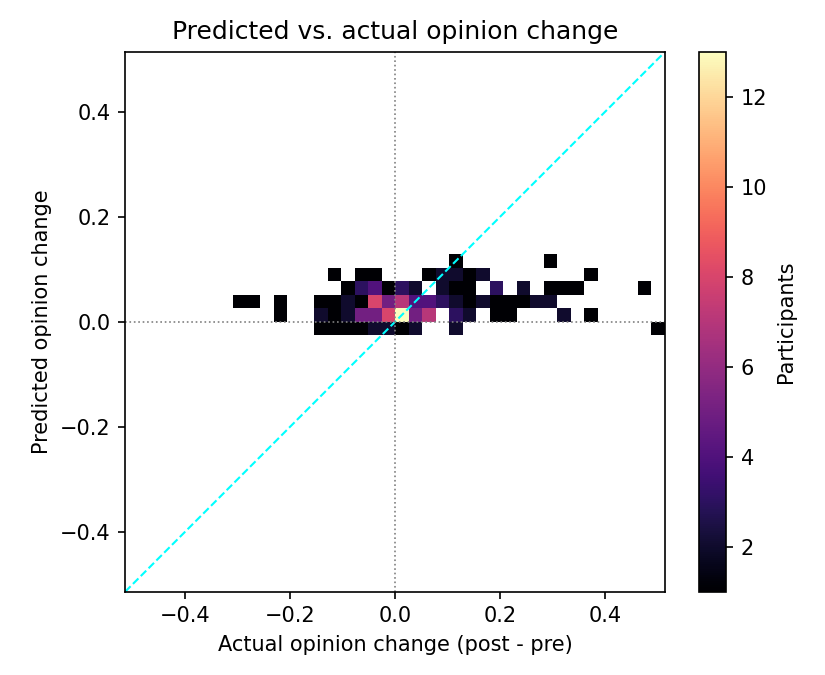
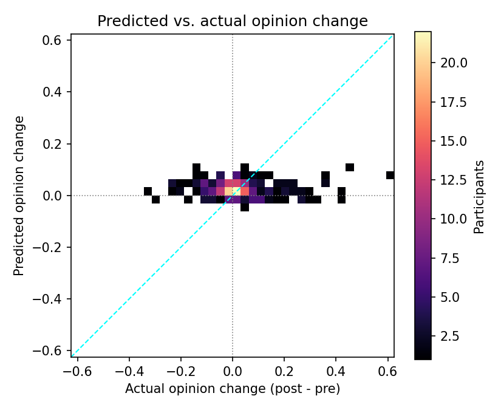

# KNN Opinion Shift Study

This study evaluates a second KNN baseline that predicts each participant's post-study opinion index and compares it with the observed survey value. The models use the same viewer prompt features as the slate-ranking baseline, but the target is the continuous after-study index for each political science study.

- Dataset: `data/cleaned_grail`
- Splits: train for neighbor lookup, validation for evaluation
- Metrics: MAE / RMSE / R² on the predicted post index, plus comparison to a no-change baseline (predicting the pre index)
- Predictions now anchor each participant’s pre-study index and add the KNN-estimated opinion shift from similar viewers.

## TF-IDF Feature Space

| Study | Participants | Best k | MAE ↓ | RMSE ↓ | R² ↑ | No-change MAE ↓ |
| --- | ---: | ---: | ---: | ---: | ---: | ---: |
| Study 1 – Gun Control (MTurk) | 162 | 10 | 0.217 | 0.259 | 0.184 | 0.037 |
| Study 2 – Minimum Wage (MTurk) | 165 | 25 | 0.173 | 0.219 | 0.374 | 0.096 |
| Study 3 – Minimum Wage (YouGov) | 257 | 50 | 0.185 | 0.236 | 0.181 | 0.084 |

- Plots: `tfidf/mae_*.png`, `tfidf/r2_*.png`
- Heatmaps benchmark predicted vs actual change: `tfidf/change_heatmap_*.png`
- Opinion-change heatmaps: `tfidf/change_heatmap_*.png`

## Word2Vec Feature Space

| Study | Participants | Best k | MAE ↓ | RMSE ↓ | R² ↑ | No-change MAE ↓ |
| --- | ---: | ---: | ---: | ---: | ---: | ---: |
| Study 1 – Gun Control (MTurk) | 162 | 5 | 0.202 | 0.254 | 0.214 | 0.037 |
| Study 2 – Minimum Wage (MTurk) | 165 | 10 | 0.162 | 0.207 | 0.440 | 0.096 |
| Study 3 – Minimum Wage (YouGov) | 257 | 50 | 0.177 | 0.226 | 0.251 | 0.084 |

- Plots: `word2vec/mae_*.png`, `word2vec/r2_*.png`
- Heatmaps benchmark predicted vs actual change: `word2vec/change_heatmap_*.png`
- Opinion-change heatmaps: `word2vec/change_heatmap_*.png`

### Opinion Change Heatmaps

Below are the 2D histograms comparing the observed shift in opinion index (post - pre) with the KNN-predicted shift for each study. Axes are centered on zero so the diagonal highlights perfect agreement.

#### TF-IDF

#### Word2Vec

## Takeaways

- The post-study shifts are small; predicting “no change” (pre index) yields MAE between 0.04 and 0.10. Both TF-IDF and Word2Vec KNN models perform worse than this simple baseline on MAE, indicating limited signal in the prompt text for forecasting the final survey response.
- Word2Vec embeddings offer lower MAE and higher R² than TF-IDF on the minimum-wage studies, suggesting smoother neighbor weighting in that feature space.
- Performance improves modestly with larger `k`—best settings range from 5 to 50—highlighting the need for wider neighborhoods when regressing opinion indices.

Artifacts are saved under `models/knn/opinion/<feature_space>/<study>/` with per-participant predictions (`..._validation.jsonl`) and detailed metrics (`..._metrics.json`).
