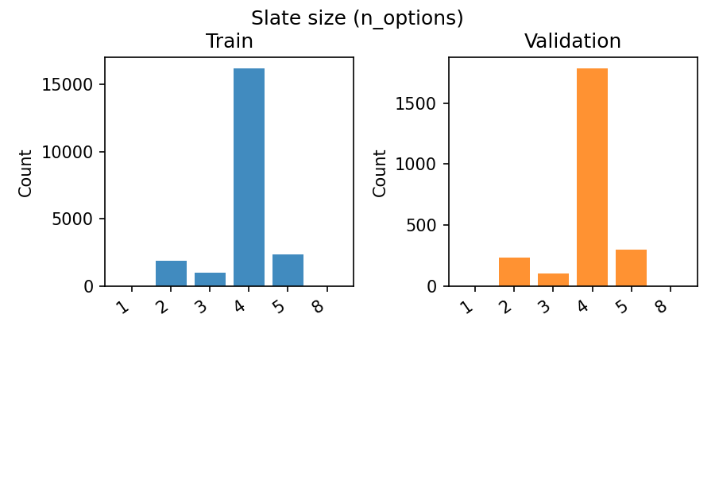

# Prompt feature report

## Dataset coverage notes

Statistics and charts focus on the core study sessions (study1–study3) covering the `gun_control` and `minimum_wage` issues.

- Train: 5293 of 7394 rows retained (71.6% coverage); excluded rows from study4: 665, unknown: 1436
- Validation: 586 of 781 rows retained (75.0% coverage); excluded rows from study4: 68, unknown: 127

> "The short answer is that sessions.json contains EVERYTHING.
Every test run, every study.
In addition to the studies that involved watching videos on the platform,
it also contains sessions from the “First Impressions” study and the “Shorts” study
(Study 4 in the paper).
Those sessions involved no user decisions.
Instead they played predetermined videos that were
either constant or increasing in their extremeness.
All are differentiated by the topicId." — Emily Hu (University of Pennsylvania)

- Original study participants: 1,650 (Study 1 — gun rights)
  1,679 (Study 2 — minimum wage MTurk), and 2,715 (Study 3 — minimum wage YouGov).
- Cleaned dataset participants captured here: 1517 (gun control) and 4362 (minimum wage).
  Study 4 (Shorts) is excluded because the released interaction logs
  do not contain recommendation slates.
- Shortfall summary (Studies 1–3 only):
  - Study 1 (gun control MTurk): 1650 expected vs. 1517 usable (-133).
    98 sessions log only the starter clip (`vids` length = 1) and 15 log multiple clips but no recommendation slate (`displayOrders` empty).
  - Study 2 (minimum wage MTurk): 1679 expected vs. 1647 usable (-32).
    14 sessions log only the starter clip; 17 have multiple clips but no slate metadata (`displayOrders` empty).
  - Study 3 (minimum wage YouGov): 2715 expected vs. 2715 usable (no gap).
    No gap — interaction logs are complete.
- Only gun-control and minimum-wage sessions (Studies 1–3) are retained;
  other topic IDs from the capsule are excluded.

Figures directory: `figures`

## Demographic completeness

| Split | Rows | Missing all demographics | Share |
|-------|------|--------------------------|-------|
| train | 5293 | 0 | 0.00% |
| validation | 586 | 0 | 0.00% |
| overall | 5879 | 0 | 0.00% |

## Profile availability

| Split | Rows | Missing profile | Share missing |
|-------|------|-----------------|---------------|
| train | 5293 | 0 | 0.00% |
| validation | 586 | 0 | 0.00% |

## Prior video counts

| Prior videos | Train | Validation |
|--------------|-------|------------|
| 0 | 4867 | 552 |
| 1 | 336 | 28 |
| 2 | 57 | 5 |
| 3 | 33 | 1 |

## Slate size distribution (`n_options`)

| Slate size | Train | Validation |
|------------|-------|------------|
| 1 | 4 | 0 |
| 2 | 397 | 33 |
| 3 | 293 | 33 |
| 4 | 3695 | 423 |
| 5 | 904 | 97 |

## Unique content coverage

| Split | Current videos | Gold videos | Candidate videos | Unique slates | Prompt texts |
|-------|----------------|-------------|------------------|---------------|--------------|
| train | 43 | 170 | 188 | 2792 | 5291 |
| validation | 24 | 100 | 128 | 494 | 586 |
| overall | 44 | 171 | 188 | 2987 | 5877 |

## Unique participants

| Split | Participants (all issues) |
|-------|---------------------------|
| train | 5293 |
| validation | 586 |
| overall | 5879 |

## Features skipped due to missing data

- binge_youtube
- city
- civic_engagement
- county
- gun_identity
- gun_policy
- gun_priority
- household_size
- marital_status
- media_diet
- minwage_importance
- minwage_priority
- minwage_text_r_w3
- news_consumption
- news_sources
- news_sources_top
- occupation
- platform_use
- social_media_use
- veteran
- vote_2024
- zip3
