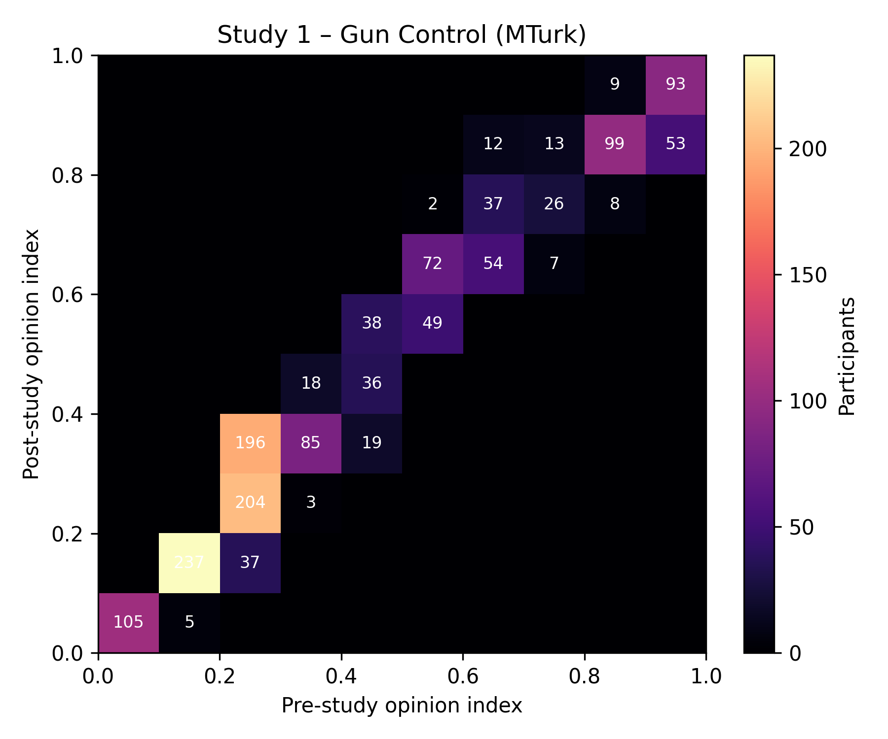
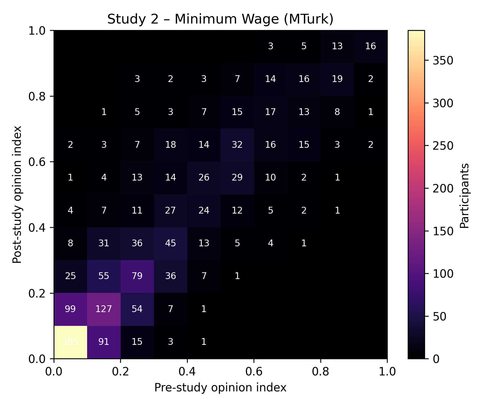
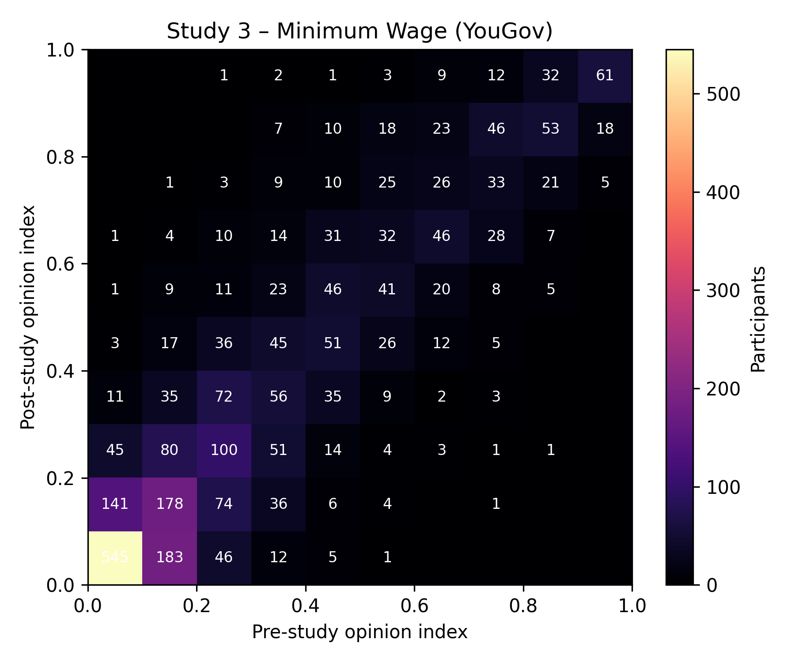
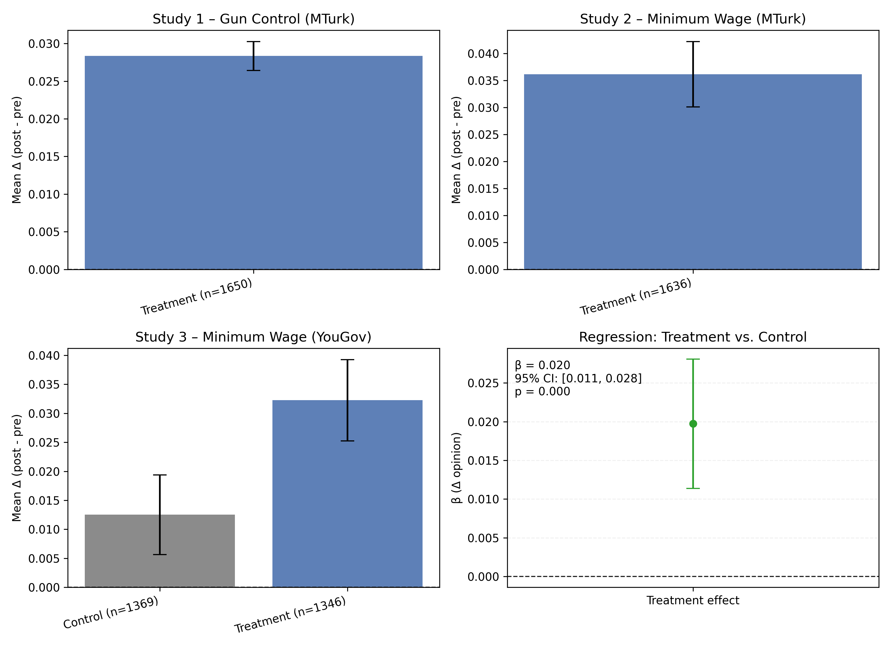

# RESEARCH ARTICLE POLITICAL SCIENCES

## Short-term exposure to filter-bubble recommendation systems has limited polarization effects

This section replicates headline opinion-shift findings from _Short-term exposure to filter-bubble recommendation systems has limited polarization effects: Naturalistic experiments on YouTube_ (Liu et al., PNAS 2025) using the cleaned data in this repository.

### Opinion shift summary

| Study | Participants | Mean pre | Mean post | Mean change | Median change | Share ↑ | Share ↓ | Share \|Δ\| ≤ 0.05 |
| ------ | -------------- | ---------- | ----------- | ------------- | --------------- | --------- | --------- | ----------- |
| Study 1 – Gun Control (MTurk) | 1517 | 0.411 | 0.439 | 0.028 | 0.025 | 74.2% | 18.9% | 75.4% |
| Study 2 – Minimum Wage (MTurk) | 1607 | 0.264 | 0.300 | 0.036 | 0.011 | 54.0% | 39.5% | 49.0% |
| Study 3 – Minimum Wage (YouGov) | 2715 | 0.314 | 0.336 | 0.022 | 0.009 | 52.6% | 42.7% | 44.0% |

The minimal mean shifts and high share of small opinion changes (|Δ| ≤ 0.05 on a 0–1 scale) mirror the paper's conclusion that short-term algorithmic perturbations produced limited polarization in Studies 1–3.

### Pre/post opinion heatmaps

### Control vs. treatment shifts and pooled regression

The first three panels separate mean opinion changes for the control and treatment arms of Studies 1–3 with 95% confidence intervals. The fourth panel reports the pooled regression coefficient comparing treatment versus control after adjusting for baseline opinion and study fixed effects.

Replication notes: opinion indices are scaled to [0, 1] and computed from the same survey composites used in the published study. Participants lacking a post-wave response are excluded from the relevant heatmap and summary.

### Control vs. treatment summary

| Study | Control Δ | Treatment Δ |
| ------ | ---------- | ------------ |
| Study 1 – Gun Control (MTurk) | 0.033 | 0.029 |
| Study 2 – Minimum Wage (MTurk) | -0.007 | 0.034 |
| Study 3 – Minimum Wage (YouGov) | 0.012 | 0.031 |

Pooled regression (control-adjusted) β̂ ≈ 0.018 with p ≈ 1.33e-11.

### Preregistered stratified contrasts

| Study | Cell | Outcome | Effect (95% CI) | MDE (80% power) | q-value | N |
| ------ | ---- | ------- | ---------------- | ---------------- | ------- | --- |
| Study 1 – Gun Control (MTurk) | Ideologues (conservative) | Gun policy index | +0.016 [-0.006, +0.038] | 0.031 | n/a | 1618 |
| Study 1 – Gun Control (MTurk) | Ideologues (liberal) | Gun policy index | -0.007 [-0.022, +0.008] | 0.022 | n/a | 1618 |
| Study 1 – Gun Control (MTurk) | Moderates (conservative seed) | Gun policy index | -0.019 [-0.052, +0.015] | 0.047 | n/a | 1618 |
| Study 1 – Gun Control (MTurk) | Moderates (liberal seed) | Gun policy index | -0.005 [-0.047, +0.037] | 0.061 | n/a | 1618 |
| Study 2 – Minimum Wage (MTurk) | Ideologues (conservative) | Minimum wage index | +0.014 [-0.009, +0.038] | 0.034 | n/a | 1637 |
| Study 2 – Minimum Wage (MTurk) | Ideologues (liberal) | Minimum wage index | +0.000 [-0.013, +0.013] | 0.018 | n/a | 1637 |
| Study 2 – Minimum Wage (MTurk) | Moderates (conservative seed) | Minimum wage index | +0.027 [-0.010, +0.064] | 0.053 | n/a | 1637 |
| Study 2 – Minimum Wage (MTurk) | Moderates (liberal seed) | Minimum wage index | -0.018 [-0.047, +0.010] | 0.041 | n/a | 1637 |
| Study 3 – Minimum Wage (YouGov) | Ideologues (conservative) | Minimum wage index | +0.031 [+0.012, +0.051] | 0.028 | 0.007 | 2715 |
| Study 3 – Minimum Wage (YouGov) | Ideologues (liberal) | Minimum wage index | +0.005 [-0.005, +0.016] | 0.015 | n/a | 2715 |
| Study 3 – Minimum Wage (YouGov) | Moderates (conservative seed) | Minimum wage index | +0.046 [+0.017, +0.076] | 0.042 | 0.009 | 2715 |
| Study 3 – Minimum Wage (YouGov) | Moderates (liberal seed) | Minimum wage index | +0.004 [-0.023, +0.030] | 0.038 | n/a | 2715 |
q-values reflect the paper's hierarchical FDR correction applied within each outcome family.
