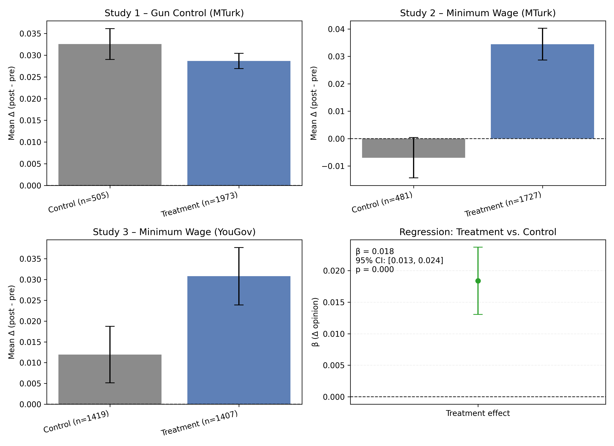

# RESEARCH ARTICLE POLITICAL SCIENCES

Documentation: [https://grail-simulation.readthedocs.io/en/latest/index.html](https://grail-simulation.readthedocs.io/en/latest/index.html)

## Short-term exposure to filter-bubble recommendation systems has limited polarization effects

This section replicates headline opinion-shift findings from _Short-term exposure to filter-bubble recommendation systems has limited polarization effects: Naturalistic experiments on YouTube_ (Liu et al., PNAS 2025) using the cleaned data in this repository.

### Opinion shift summary

| Study | Participants | Mean pre | Mean post | Mean change | Median change | Share ↑ | Share ↓ | &#124;Δ&#124; ≤ 0.05 |
|-------|--------------|----------|-----------|-------------|---------------|---------|---------|-----------|
| Study 1 – Gun Control (MTurk) | 1517 | 0.411 | 0.439 | 0.028 | 0.025 | 74.2% | 18.9% | 75.4% |
| Study 2 – Minimum Wage (MTurk) | 1607 | 0.264 | 0.300 | 0.036 | 0.011 | 54.0% | 39.5% | 49.0% |
| Study 3 – Minimum Wage (YouGov) | 2715 | 0.314 | 0.336 | 0.022 | 0.009 | 52.6% | 42.7% | 44.0% |

The minimal mean shifts and high share of small opinion changes (&#124;Δ&#124; ≤ 0.05 on a 0–1 scale) mirror the paper's conclusion that short-term algorithmic perturbations produced limited polarization in Studies 1–3.

### Pre/post opinion heatmaps

### Mean shifts with 95% confidence intervals

Replication notes: opinion indices are scaled to [0, 1] and computed from the same survey composites used in the published study. Participants lacking a post-wave response are excluded from the relevant heatmap and summary.
