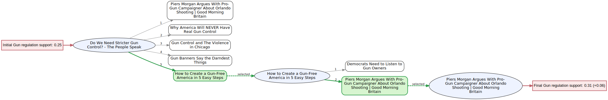
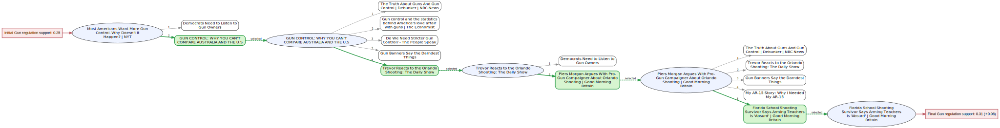
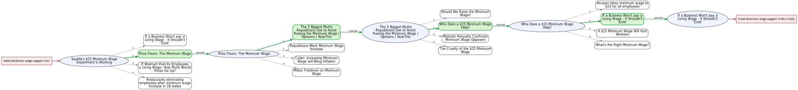
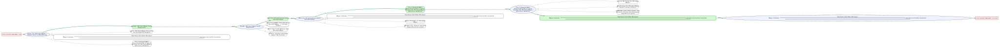

# Visualized Recommendation Trees

This report collects four Graphviz exports produced by the `visualize_recommendation_trees` tooling in `src/visualization/recommendation_tree_viz.py`. The assets previously lived under `docs/batch_sessions`; they now reside in `reports/visualized_recommendation_trees/figures` so the trees can ship alongside other analyst-facing summaries.

To regenerate any figure, rerun the visualizer with the desired session identifier, for example:

```bash
python -m src.visualization.recommendation_tree_viz --session-id <session_id> --output-dir reports/visualized_recommendation_trees/figures
```

## Gun Control Sessions

### grail_session_gun_control_1

- Support shift: `0.25 -> 0.31 (+0.06)`
- Start: `Do We Need Stricter Gun Control? - The People Speak`
- Clicked path: `How to Create a Gun-Free America in 5 Easy Steps` -> `Piers Morgan Argues With Pro-Gun Campaigner About Orlando Shooting | Good Morning Britain`
- Recommendation slate highlights: `Why America Will NEVER Have Real Gun Control`, `Gun Control and The Violence in Chicago`, `Gun Banners Say the Darndest Things`, `Democrats Need to Listen to Gun Owners`

### grail_session_gun_control_2

- Support shift: `0.25 -> 0.31 (+0.06)`
- Start: `Most Americans Want More Gun Control. Why Doesn't It Happen? | NYT`
- Clicked path: `GUN CONTROL: WHY YOU CAN'T COMPARE AUSTRALIA AND THE U.S` -> `Trevor Reacts to the Orlando Shooting: The Daily Show` -> `Piers Morgan Argues With Pro-Gun Campaigner About Orlando Shooting | Good Morning Britain` -> `Florida School Shooting Survivor Says Arming Teachers is 'Absurd' | Good Morning Britain`
- Recommendation slate highlights: `Democrats Need to Listen to Gun Owners`, `The Truth About Guns And Gun Control | Debunker | NBC News`, `Gun control and the statistics behind America's love affair with guns | The Economist`, `My AR-15 Story: Why I Needed My AR-15`

## Minimum Wage Sessions

### grail_session_minimum_wage_1

- Support shift: `0.07 -> 0.09 (+0.02)`
- Start: `Seattle's $15 Minimum Wage Experiment is Working`
- Clicked path: `Price Floors: The Minimum Wage` -> `The 5 Biggest Myths Republicans Use to Avoid Raising the Minimum Wage | Opinions | NowThis` -> `Who Does a $15 Minimum Wage Help?` -> `If a Business Won't pay a Living Wage - it Shouldn't Exist`
- Recommendation slate highlights: `If Walmart Paid Its Employees a Living Wage, How Much Would Prices Go Up?`, `Restaurants eliminating employees after minimum wage increase in 18 states`, `Republicans Block Minimum Wage Increase`, `Milton Friedman on Minimum Wage`

### grail_session_minimum_wage_2

- Support shift: `0.05 -> 0.20 (+0.15)`
- Start: `Raise The Minimum Wage -- Robert Reich & MoveOn.org`
- Clicked path: `Stossel: Minimum Wage Hurts Beginners` -> `What the US gets wrong about minimum wage` -> `The 5 Biggest Myths Republicans Use to Avoid Raising the Minimum Wage | Opinions | NowThis` -> `Fast Food CEO After Minimum Wage Increase: "I was stunned by the business"`
- Recommendation slate highlights: `Caller: Minimum Wage Should be set by Supply & Demand`, `What They DONT TELL YOU About Minimum Wage... | Thomas Sowell`, `Walmart CEO: Federal minimum wage should be raised`, `SOMEONE GIVE HIM A RAISE: Ben Shapiro kills the minimum wage argument for good`
