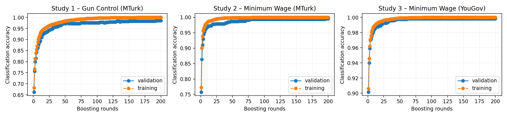

# XGBoost Next-Video Baseline

Slate-ranking accuracy for the selected XGBoost configuration.

- Dataset: `/n/fs/similarity/grail-simulation/data/cleaned_grail`
- Split: validation
- Metrics: accuracy, coverage of known candidates, and availability of known neighbors.
- Table columns capture validation accuracy, counts of correct predictions, known-candidate recall, and probability calibration for the selected slates.
- `Known hits / total` counts successes among slates that contained a known candidate; `Known availability` is the share of evaluations with any known candidate present.
- `Avg prob` reports the mean predicted probability assigned to known candidate hits.

## Portfolio Summary

- Weighted accuracy 0.995 across 2,419 evaluated slates.
- Weighted known-candidate coverage 0.995 over 2,417 eligible slates.
- Known-candidate availability 0.999 relative to all evaluated slates.
- Mean predicted probability on known candidates 0.961 (across 3 studies with recorded probabilities).
- Highest study accuracy: Study 3 – Minimum Wage (YouGov) (0.998).
- Lowest study accuracy: Study 1 – Gun Control (MTurk) (0.987).

| Study | Issue | Accuracy ↑ | Correct / evaluated | Coverage ↑ | Known hits / total | Known availability ↑ | Avg prob ↑ |
| --- | --- | ---: | --- | ---: | --- | ---: | ---: |
| Study 1 – Gun Control (MTurk) | Gun Control | 0.987 | 541/548 | 0.991 | 541/546 | 0.996 | 0.936 |
| Study 2 – Minimum Wage (MTurk) | Minimum Wage | 0.994 | 667/671 | 0.994 | 667/671 | 1.000 | 0.963 |
| Study 3 – Minimum Wage (YouGov) | Minimum Wage | 0.998 | 1,198/1,200 | 0.998 | 1,198/1,200 | 1.000 | 0.985 |

## Accuracy Curves

## Cross-Study Holdouts

Leave-one-study-out metrics were unavailable when this report was generated.

## Observations

- Study 1 – Gun Control (MTurk): accuracy 0.987, coverage 0.991, known availability 0.996.
- Study 2 – Minimum Wage (MTurk): accuracy 0.994, coverage 0.994, known availability 1.000.
- Study 3 – Minimum Wage (YouGov): accuracy 0.998, coverage 0.998, known availability 1.000.
- Average accuracy 0.993.
- Known coverage averages 0.994.
- Known candidate availability averages 0.999.
