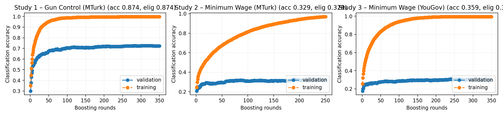

# XGBoost Next-Video Baseline

Slate-ranking accuracy for the selected XGBoost configuration.

- Dataset: `/n/fs/similarity/grail-simulation/data/cleaned_grail`
- Split: validation
- Metrics include overall accuracy, eligible-only accuracy (gold present in slate), coverage of known candidates, and availability of known neighbors.
- In the summary table below, the Accuracy column reports eligible-only accuracy to match KNN reports.
- `Known hits / total` counts successes among slates that contained a known candidate; `Known availability` is the share of evaluations with any known candidate present.
- `Avg prob` reports the mean predicted probability assigned to known candidate hits.

## Portfolio Summary

- Weighted eligible-only accuracy 0.300 across 1,871 eligible slates.
- Weighted known-candidate coverage 0.300 over 1,871 eligible slates.
- Known-candidate availability 1.000 relative to all evaluated slates.
- Mean predicted probability on known candidates 0.308 (across 2 studies with recorded probabilities).
- Highest study accuracy: Study 3 – Minimum Wage (YouGov) (0.312).
- Lowest study accuracy: Study 1 – Gun Control (MTurk) (0.000).

| Study | Issue | Acc (eligible) ↑ | Baseline ↑ | Random ↑ | Correct / evaluated | Coverage ↑ | Known hits / total | Known availability ↑ | Avg prob ↑ |
| --- | --- | ---: | ---: | ---: | --- | ---: | --- | ---: | ---: |
| Study 1 – Gun Control (MTurk) | Gun Control | — | — | — | 0/0 | 0.000 | 0/0 | — | — |
| Study 2 – Minimum Wage (MTurk) | Minimum Wage | 0.280 | 0.368 | 0.255 | 188/671 | 0.280 | 188/671 | 1.000 | 0.308 |
| Study 3 – Minimum Wage (YouGov) | Minimum Wage | 0.312 | 0.479 | 0.255 | 374/1,200 | 0.312 | 374/1,200 | 1.000 | 0.307 |

## Accuracy Curves

## Cross-Study Holdouts

Leave-one-study-out metrics were unavailable when this report was generated.

## Observations

- Study 1 – Gun Control (MTurk): accuracy 0.000, eligible accuracy —, coverage 0.000, known availability —.
- Study 2 – Minimum Wage (MTurk): accuracy 0.280, eligible accuracy 0.280, coverage 0.280, known availability 1.000.
- Study 3 – Minimum Wage (YouGov): accuracy 0.312, eligible accuracy 0.312, coverage 0.312, known availability 1.000.
- Average accuracy 0.197.
- Average eligible-only accuracy 0.296.
- Known coverage averages 0.197.
- Known candidate availability averages 1.000.
