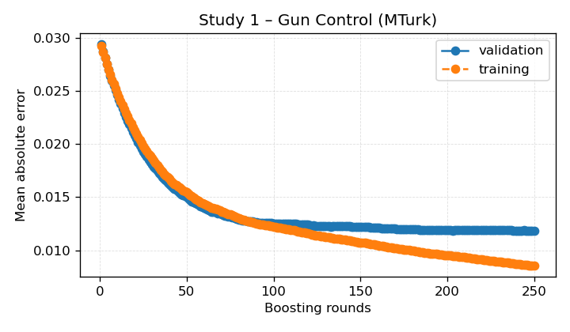
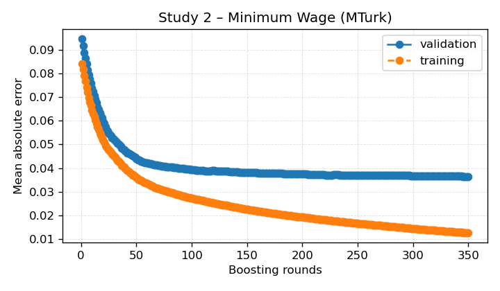
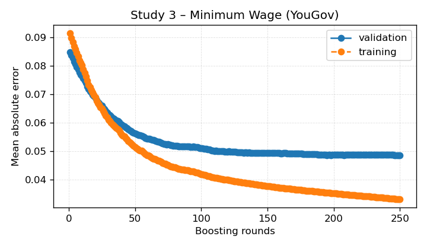

# XGBoost Opinion Regression

This summary captures the opinion-regression baselines trained with XGBoost for the selected participant studies.

- Dataset: `/n/fs/similarity/grail-simulation/data/cleaned_grail`
- Split: validation
- Metrics track MAE, RMSE, R², directional accuracy, MAE(change), RMSE(change), calibration slope/intercept, calibration ECE, and KL divergence versus the no-change baseline.
- Δ columns capture improvements relative to that baseline when available.

| Study | Participants | Accuracy ↑ | Baseline ↑ | Δ Accuracy ↑ | MAE ↓ | Δ vs baseline ↓ | RMSE ↓ | R² ↑ | MAE (change) ↓ | RMSE (change) ↓ | Δ RMSE (change) ↓ | Calib slope | Calib intercept | ECE ↓ | Δ ECE ↓ | KL div ↓ | Δ KL ↓ | Baseline MAE ↓ |
| --- | ---: | ---: | ---: | ---: | ---: | ---: | ---: | ---: | ---: | ---: | ---: | ---: | ---: | ---: | ---: | ---: | ---: | ---: |
| Study 1 – Gun Control (MTurk) | 162 | 0.864 | 0.074 | +0.790 | 0.012 | +0.025 | 0.021 | 0.994 | 0.012 | 0.021 | +0.024 | 1.084 | -0.003 | 0.004 | — | 1.557 | +19.888 | 0.037 |
| Study 2 – Minimum Wage (MTurk) | 165 | 0.836 | 0.061 | +0.776 | 0.036 | +0.060 | 0.049 | 0.969 | 0.036 | 0.049 | +0.089 | 1.106 | -0.003 | 0.013 | — | 0.572 | +17.797 | 0.096 |
| Study 3 – Minimum Wage (YouGov) | 257 | 0.739 | 0.058 | +0.681 | 0.049 | +0.036 | 0.069 | 0.930 | 0.049 | 0.069 | +0.057 | 1.064 | -0.005 | 0.008 | — | 0.788 | +15.792 | 0.084 |

## Training Curves

## Cross-Study Diagnostics

### Weighted Summary

- Weighted MAE 0.035 across 584 participants.
- Weighted baseline MAE 0.074 (+0.040 vs. final).
- Weighted directional accuracy 0.801 across 584 participants.
- Weighted baseline accuracy 0.063 (+0.738 vs. final).
- Weighted RMSE (change) 0.050 across 584 participants.
- Weighted baseline RMSE (change) 0.107 (+0.057 vs. final).
- Weighted calibration ECE 0.008 across 584 participants.
- Weighted KL divergence 0.940 across 584 participants.
- Weighted baseline KL divergence 18.435 (+17.495 vs. final).
- Largest MAE reduction: Study 2 – Minimum Wage (MTurk) (+0.060).
- Lowest MAE: Study 1 – Gun Control (MTurk) (0.012); Highest MAE: Study 3 – Minimum Wage (YouGov) (0.049).
- Highest directional accuracy: Study 1 – Gun Control (MTurk) (0.864).
- Lowest directional accuracy: Study 3 – Minimum Wage (YouGov) (0.739).
- Largest directional-accuracy gain: Study 1 – Gun Control (MTurk) (+0.790).
- Largest RMSE(change) reduction: Study 2 – Minimum Wage (MTurk) (+0.089).
- Lowest RMSE(change): Study 1 – Gun Control (MTurk) (0.021); Highest: Study 3 – Minimum Wage (YouGov) (0.069).
- Lowest calibration ECE: Study 1 – Gun Control (MTurk) (0.004); Highest: Study 2 – Minimum Wage (MTurk) (0.013).
- Largest KL divergence drop: Study 1 – Gun Control (MTurk) (+19.888).
- Lowest KL divergence: Study 2 – Minimum Wage (MTurk) (0.572); Highest: Study 1 – Gun Control (MTurk) (1.557).

- Unweighted MAE 0.032 (σ 0.015, range 0.012 – 0.049).
- MAE delta mean 0.040 (σ 0.014, range 0.025 – 0.060).
- Directional accuracy mean 0.813 (σ 0.054, range 0.739 – 0.864).
- Accuracy delta mean 0.749 (σ 0.048, range 0.681 – 0.790).
- RMSE(change) mean 0.046 (σ 0.019, range 0.021 – 0.069).
- RMSE(change) delta mean 0.057 (σ 0.027, range 0.024 – 0.089).
- Calibration ECE mean 0.008 (σ 0.004, range 0.004 – 0.013).
- KL divergence mean 0.972 (σ 0.423, range 0.572 – 1.557).
- KL divergence delta mean 17.826 (σ 1.672, range 15.792 – 19.888).

## Observations

- Study 1 – Gun Control (MTurk): MAE 0.012 (Δ vs. baseline +0.025), RMSE(change) 0.021, ECE 0.004, KL 1.557, R² 0.994.
- Study 2 – Minimum Wage (MTurk): MAE 0.036 (Δ vs. baseline +0.060), RMSE(change) 0.049, ECE 0.013, KL 0.572, R² 0.969.
- Study 3 – Minimum Wage (YouGov): MAE 0.049 (Δ vs. baseline +0.036), RMSE(change) 0.069, ECE 0.008, KL 0.788, R² 0.930.
- Average MAE reduction +0.040 across 3 studies.
- Mean R² 0.965.
- Mean RMSE(change) 0.046.
- Mean RMSE(change) delta 0.057.
- Mean calibration ECE 0.008.
- Mean KL divergence 0.972.
- Mean KL divergence delta 17.826.
